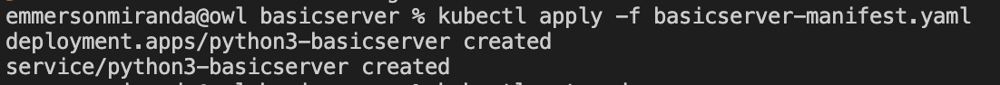
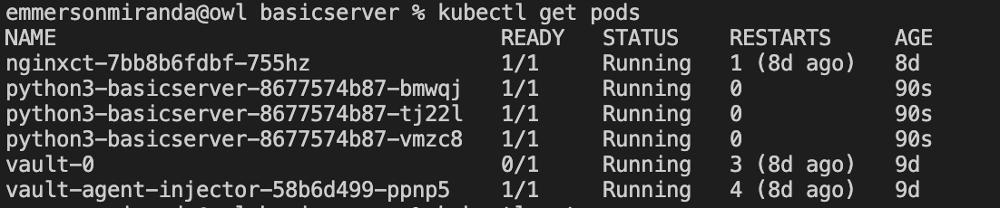
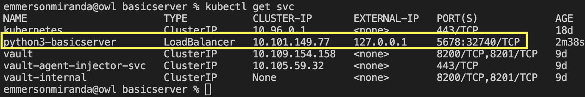
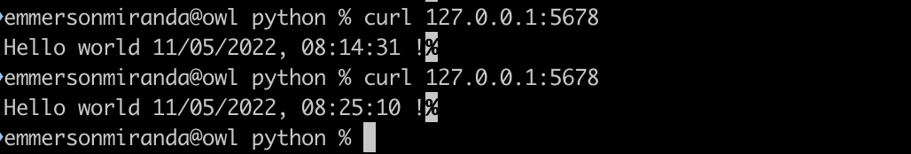

# Simple Server
This project is a simple Python3 HTTP server.

# The Python Application

The application source code is contained in the file [basicserver.py](./basicserver.py)

By default the application listen in the port 8080 and only serve GET requests to the root context path.

In case you want to use a different port specify it as command line argument:

````bash
% python3 $(pwd)/basicserver.py 1234
````

#Application packaging 
Run [build.sh](./build.sh) script to package the application in a docker container, at the end of the process the script print some additional instructions to push the image in the docker registry.

Fell free to change below variables inside build.sh script:
````bash
CONTAINER_NAME="python3-basicserver"
CONTAINER_TAG="1.0"
GITHUB_REPO="emmerson"
````


Bellow in an example of script output.
````bash
emmersonmiranda@owl basicserver % ./build.sh                                                                  
[+] Building 1.3s (8/8) 
...
...
Build finished, now you can run your image locally using: docker run  -p 8080:8080 -dit python3-basicserver:1.0
-------------------
IMAGE_ID:46e3fdd859a7
docker tag 46e3fdd859a7 emmerson/python3-basicserver:1.0
docker push emmerson/python3-basicserver:1.0
-------------------

emmersonmiranda@owl basicserver % 
````

## Testing docker image

First run the image in the terminal
````bash
emmersonmiranda@owl basicserver % docker run  -p 8080:8080  python3-basicserver:1.0 
2022-05-10 22:41:14,757 [INFO] Server started 8080
172.17.0.1 - - [10/May/2022 22:41:20] "GET / HTTP/1.1" 200 -
2022-05-10 22:41:20,284 [INFO] Get call - served
172.17.0.1 - - [10/May/2022 22:41:22] "GET / HTTP/1.1" 200 -
2022-05-10 22:41:22,779 [INFO] Get call - served
172.17.0.1 - - [10/May/2022 22:41:24] "GET / HTTP/1.1" 200 -
2022-05-10 22:41:24,535 [INFO] Get call - served
172.17.0.1 - - [10/May/2022 22:41:25] "GET / HTTP/1.1" 200 -
2022-05-10 22:41:25,745 [INFO] Get call - served
````

In a separate terminal you can run curl commands to it:
````bash
emmersonmiranda@owl python % curl localhost:8080
Hello world 10/05/2022, 22:41:20 !%
emmersonmiranda@owl python % curl localhost:8080
Hello world 10/05/2022, 22:41:22 !%
emmersonmiranda@owl python % curl localhost:8080
Hello world 10/05/2022, 22:41:24 !%
emmersonmiranda@owl python % curl localhost:8080
Hello world 10/05/2022, 22:41:25 !%
````

# Kubernetes installation
To install this container on your kubernetes cluster please apply the file [basicserver-manifest.yaml](./basicserver-manifest.yaml), this will deploy 3 replicas of the server.

````bash
kubectl apply -f basicserver-manifest.yaml
````


Check until the pod its been deployed



## Testing your installation

In a separate terminal enable minikube tunnel


In a separate terminal lets get the service EXTERNAL-IP and PORT to call the service.


Lets test the service using the information extracted from the previous step.
