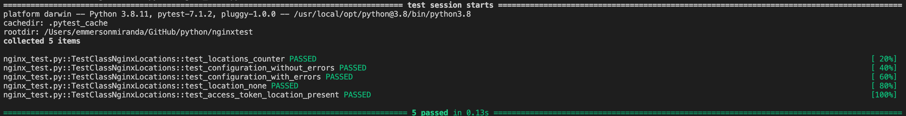

# About this

This is a simple PoC to show how to unit test nginx configurations from the requirements point of view.

This is specially usefull when you use some templating technologies to generate NGINX configuration files.

Note: Nginx has the ability to test the configuration file to know if the syntax is valid.
````
sudo nginx -t
````

## The test process
- Create or have a nginx.conf file.
- Modify the conftest.py to pointing out yo nginx file.
  - This will use crossplane to convert nginx config file into a JSON object.
- Run pytest

# Install dependencies

To install dependencies please run:

````
pip3 install -r requirements.txt
````


## Crossplane
This tool was developed by NGINX, Inc. itself and allow to convert a NGINX config file into a JSON object.

https://github.com/nginxinc/crossplane

Example
````
crossplane parse --indent=4 -o nginx.conf.json --include-comments nginx.conf
`````

## Pytest
This is a testing tool to create python tests.

https://docs.pytest.org/en/stable/getting-started.html

Example
````
pytest nginx_test.py -v 
````




